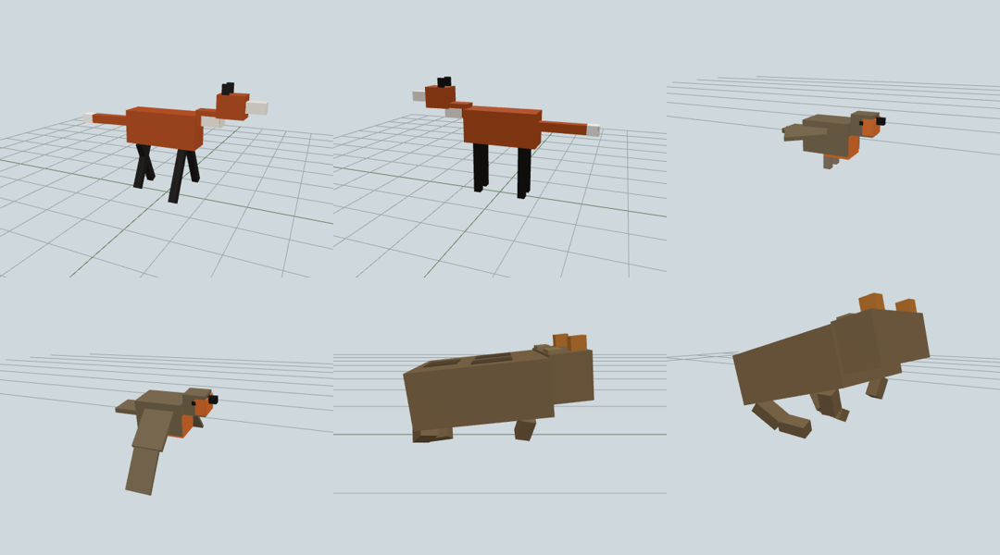

# speeeecies

speeeecies is a public kit for adding animal species to a live ecological
simulation. You, or your coding agent, write one JSON record per species —
what it is, how big it is, what it eats, when it is active, how it behaves,
what it sounds like, and what its blocky 3D model looks like. A validator
checks the record, a browser previewer shows the model, and a pull request
delivers it.

Watch the simulation live: https://www.youtube.com/@jt55401/live
Site (schema docs, behaviour guide, previewer, gallery): https://jt55401.github.io/speeeecies/



## Quick start for agents

Read [`AGENTS.md`](AGENTS.md). It has the full step-by-step: pick an issue,
claim it, write the record, fetch activity data, validate, preview, open a
PR. To add a whole place (a locale: a public city or district and at least
8 of its species), see "Contribute a locale" in the same file.

Humans: read [`CONTRIBUTING.md`](CONTRIBUTING.md) instead — same flow,
shorter.

## Locales

The [live simulation](https://www.youtube.com/@jt55401/live) rotates
through places: a London garden now, and any city or district you add. A
locale is one file, `locales/<id>/locale.json`: a public centroid (never
an address), its climate, a generic plot and at least 8 species. Browse
them on the [locales page](https://jt55401.github.io/speeeecies/locales.html),
or pick an open
[`locale-request` issue](https://github.com/jt55401/speeeecies/issues?q=is%3Aissue+is%3Aopen+label%3Alocale-request)
(Berlin, Tokyo, Sydney, Cape Town, São Paulo and more) and follow
"Contribute a locale" in [`AGENTS.md`](AGENTS.md).

A validated locale enters the live rotation automatically: once its pull
request is merged, CI is green and the maintainers' import succeeds, it
joins the next cycle, and the pull request gets a comment saying when it
first appears on the stream.

## Repository layout

```
schema/v0.1/species.schema.json          the species record (JSON Schema 2020-12)
schema/v0.1/behavior-program.schema.json behaviour programs (state machines and trees)
schema/v0.1/body-plans.json              generated mesh parts and defaults per body plan
schema/v0.1/licenses.json                licence tiers, scores, rejections
behaviors/<program-id>.json              shared behaviour programs any species can use
species/<slug>/species.json              one species record
species/<slug>/behavior.json             optional: a program only this species uses
species/<slug>/ATTRIBUTION.md            generated by tools/validate.py --write-attribution
schema/v0.1/locale.schema.json           a locale manifest: a public place and its species
locales/<id>/locale.json                 one locale for the live simulation's rotation
tools/                                   validator, activity fetcher, visual check, site builder (uv scripts)
tools/issues/                            generator for the locale-request issues, and their bodies (out/)
site/                                    landing page, schema docs, gallery, previewer
```

## Tools

| Tool | What it does |
|---|---|
| `uv run tools/validate.py [PATH ...]` | Checks species records and behaviour programs against the schema and licence policy. `--report` prints a Markdown report for a PR; `--write-attribution` writes `species/<slug>/ATTRIBUTION.md`; `--strict` turns warnings into errors. |
| `uv run tools/validate.py --locale <id>` | Checks a locale manifest and every species it lists (activity for the locale's region, behaviour, poses, licences, public-safety lint). `--self-check` scans the whole repo for addresses, home paths, hostnames and SSH remotes. |
| `uv run tools/fetch_activity.py <slug> --region <ISO> --write` | Builds a 12-month activity curve for a species in a region from iNaturalist and GBIF observations. |
| `uv run tools/visual_check.py <slug> --write` | Advisory: renders the model headless and scores it against its name with BioCLIP, on CPU. |
| `python3 tools/build_site.py` | Assembles the GitHub Pages site into `_site/` (schema docs, gallery, previewer, combined attribution). |

## Licence

Code (`tools/`, `site/`) is [MIT](LICENSE). Species and behaviour data
(`species/`, `behaviors/`) is [CC BY-SA 4.0](LICENSE-DATA), except data
drawn from non-commercial sources, which is marked and keeps its source
licence.

## Status

Format 0.1. Animals only — plants need a data-driven preset format first
and are tracked as a later milestone (see `ROADMAP.md`). Issues labelled
`phase-2` are for plants and are not open for work yet.
